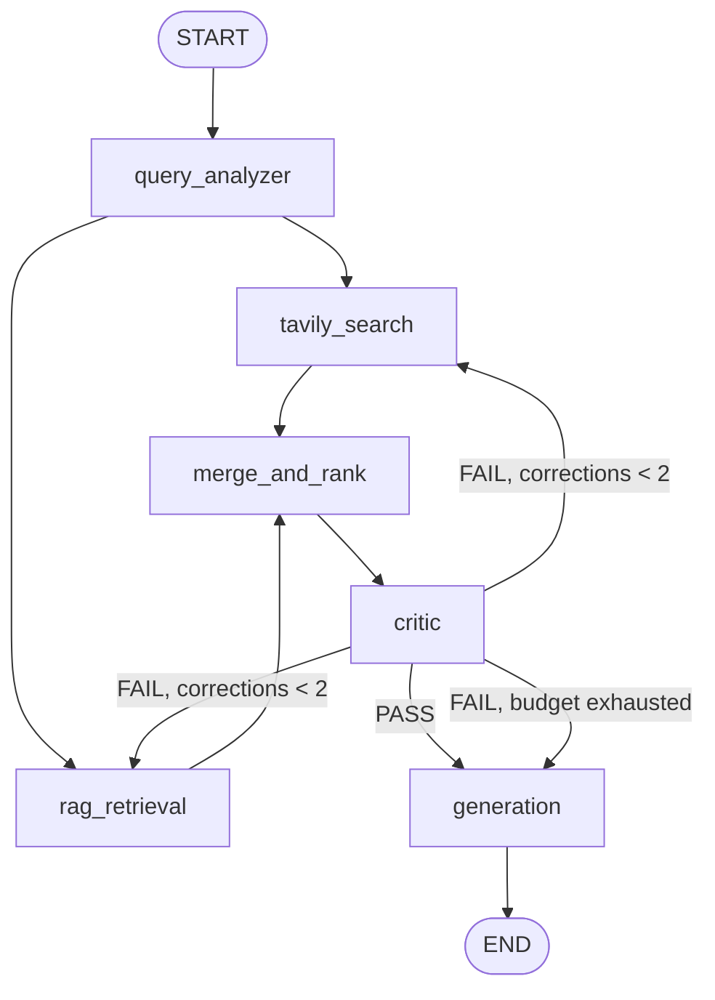

# Parallel Research Agent

A LangGraph agent that answers research questions by retrieving from two heterogeneous sources in parallel, judging whether the evidence is sufficient, and re-retrieving with targeted feedback when it isn't.

**Live:** [https://langgraphreaserchagent-production.up.railway.app]
**API docs:** https://langgraphreaserchagent-production.up.railway.app/docs

```bash
curl -X POST https://langgraphreaserchagent-production.up.railway.app/research \
  -H "Content-Type: application/json" \
  -d '{"question": "What is Walmart'\''s 2026 e-commerce revenue?"}'
```

---

## What it does

Given a research question, the agent decomposes it into search queries, retrieves from the public web and a private document corpus **concurrently**, fuses the two result sets, and has a critic node judge whether the evidence actually answers the question. On failure the critic emits a specific gap ("sources cover Walmart but not Amazon's market position") which is fed back into retrieval. The loop is bounded at two corrections; exhausting it produces a degraded answer rather than an exception.

The output is a structured report where **the language model writes the prose and code asserts the facts** — source listings and the confidence assessment are computed from graph state, not generated.

```
# How does Walmart's omnichannel strategy compare to Amazon's market position?

## Summary
Walmart's omnichannel strategy focuses on integrating its physical store
network with digital capabilities... In contrast, Amazon maintains a
dominant position with a 37.6% U.S. market share...

## Key Findings
- Walmart reported a 22% increase in global e-commerce sales [2]
- Amazon leads the U.S. e-commerce market with 37.6% share [4]
...

## Web Sources
2. [Walmart's Omnichannel Strategy...](https://finance.yahoo.com/...)
4. [Amazon Statistics & Market Share 2026](https://demandsage.com/...)

## Doc Sources
1. Project Overview- Capstone.docx — `6ba140d7…`

## Confidence
**Moderate** — 3 web source(s), 2 document source(s), 1 correction(s).
Sources were judged sufficient after 1 correction attempt(s).
```

---

## Architecture



| Node | Reads | Writes | Responsibility |
|---|---|---|---|
| `query_analyzer` | `question` | `sub_questions` | Decompose into the minimum set of search queries |
| `tavily_search` | `sub_questions`, `critic_feedback` | `raw_results` | Web retrieval, one concurrent request per query |
| `rag_retrieval` | `sub_questions`, `critic_feedback` | `raw_results` | Document retrieval via HTTP, relevance-filtered |
| `merge_and_rank` | `raw_results` | `ranked_results` | Dedupe by identity, fuse by rank, keep top-K |
| `critic` | `question`, `ranked_results` | `critic_verdict`, `critic_feedback`, `correction_count` | Judge sufficiency, name the gap, own the retry budget |
| `generation` | `question`, `ranked_results` | `report` | Cited prose; source lists and confidence added in code |

### State

Eight keys, **one reducer**:

```python
class ResearchState(TypedDict):
    question: str
    sub_questions: list[str]
    raw_results: Annotated[list[dict], operator.add]   # the only reducer
    ranked_results: list[dict]                         # overwrite
    critic_verdict: str
    critic_feedback: str
    correction_count: int
    report: str
```

`raw_results` needs `operator.add` because two nodes write it **in the same superstep**. Without a reducer LangGraph raises `InvalidUpdateError` — it is not last-write-wins, and fan-out structurally requires a reducer rather than merely benefiting from one.

`ranked_results` is the same Python type with no annotation, and that pairing is deliberate: see *Cycles and stale state* below.

---

## Engineering decisions

### Cross-source ranking: fusion by rank, not by score

The two retrieval sources return scores from different models on different scales. A cross-encoder reranker emits an unbounded **logit**; the web provider emits a 0–1 relevance figure. Ranking them together assumes a shared unit that does not exist.

This failed twice, in opposite directions:

| Attempt | Observed | Result |
|---|---|---|
| Raw logits | web `0–1` vs docs `−11.2 to 7.8` | Every web result outranked every document |
| Sigmoid-calibrated | web `0.660–0.924` vs docs `0.869–0.996` | Document **floor** exceeded web **ceiling** — web structurally excluded |

The sigmoid step was correct in itself — a cross-encoder is a binary relevance classifier, so passing its logit through a sigmoid recovers the calibrated probability it actually produced, and logit 0 gives a principled relevance threshold at p = 0.5 rather than a tuned constant. But calibrating one source does not make it comparable with an uncalibrated one.

**Resolution: reciprocal rank fusion** over `(source_type, sub_question)` groups.

```python
rrf(item) = 1 / (k + rank_within_its_group)      # k = 60
```

Each group can reliably answer *"which of my results is best."* Neither can answer *"is my 0.994 better than your 0.924."* Fusing by position uses only the claim each source can support.

Measured effect on a comparison question:

| | Score sort | Fusion by source | Fusion by source + sub-question |
|---|---|---|---|
| Verdict | FAIL | FAIL | **PASS** |
| Corrections used | 3 (exhausted) | 3 (exhausted) | **1** |
| Amazon content in top-5 | none | none | market share, revenue, comparison |
| Wall clock | 16.95 s | 16.11 s | **12.48 s** |

The intermediate step is included because it matters: grouping by source alone fixed source-level dominance and exposed the same problem one level down, where one sub-question's results took every slot within a source. Provenance is threaded through retrieval so every source *and* every sub-question contributes its best item.

**Trade-off, stated plainly:** absolute quality is discarded. A weak group's best item still takes a slot. The system asserts that covering every part of the question outweighs the five best results overall — right for comparison questions, arguably wrong for narrow factual ones.

### Cycles and stale state

An append reducer is mandatory for fan-out and hazardous in a loop. Across a three-pass correction cycle:

| Pass | `raw_results` | After dedupe | Duplicates removed |
|---|---|---|---|
| 1 | 10 | 8 | 2 (20%) |
| 2 | 26 | 12 | 14 (54%) |
| 3 | 41 | 14 | **27 (66%)** |

By the third pass two thirds of the accumulated pool is duplicate. And the key **cannot be cleared**: returning an empty list computes `operator.add(old, [])` which is `old` — under an append reducer an empty return is a no-op, so no node can reset it.

The fix is structural: an appending scratch key (`raw_results`) separated from an overwriting output key (`ranked_results`), with an idempotent dedupe-aware consumer between them. Stale accumulation becomes harmless because the only reader of the scratch key deduplicates, and everything downstream reads the overwriting key.

### Bounded self-correction

The critic owns `correction_count`, and that placement is forced rather than stylistic:

| Placement | Mechanism | Failure |
|---|---|---|
| Routing function | Routers return a destination; they cannot write state | Counter never advances — infinite loop |
| Parallel retrieval nodes, overwrite | Both run in one superstep, both read 0, both write 1 | `InvalidUpdateError` |
| Parallel retrieval nodes, add reducer | Writes merge: `0 + 1 + 1 = 2` after one pass | **Silent** — budget of 2 behaves as 1 |
| **Critic** | One writer, alone in its superstep, detects the condition | Correct |

The comparison operator in the loop guard is coupled to what the counter counts. When the counter was corrected from *evaluations completed* to *corrections requested*, `>=` had to become `>` — changing one without the other shifts the retry budget by one, and the only symptom is cost. Both boundaries are pinned by tests.

### Degradation over failure

Every failure path produces a completed run with the failure surfaced in the response:

- A retrieval branch raising would kill its entire superstep and discard the sibling's successful results — so both branches catch broadly, log the exception type, and return an empty update.
- The document service being unreachable degrades to web-only, and the report's Confidence block says so.
- Exhausting the correction budget generates from the best available evidence, marked **Low** with the reason stated.
- Citation markers pointing at non-existent sources are stripped, and the count of removals is reported rather than silently repaired.

### The model writes prose; code asserts facts

Confidence depends on facts the model cannot see — the correction count, the critic's final verdict, whether a source contributed nothing, whether citations were valid. Asking a model to assess its own reliability produces a plausible sentence based on none of that. Four levels are derived from state:

| Level | Condition |
|---|---|
| High | PASS, zero corrections |
| Moderate | PASS after one or more corrections |
| Low | FAIL at the correction limit |
| None | No sources retrieved |

Source listings are rendered from state for the same reason: the titles and URLs are already exact, so a generative round trip can only lose fidelity.

---

## Measured performance

### Parallel vs sequential retrieval

Same graph builder behind a topology flag — only the four retrieval edges differ, so every node, prompt, and model is provably identical between configurations.

| Stage | Sequential | Parallel | Reduction |
|---|---|---|---|
| Retrieval | 4.43 s | 3.14 s | **29%** |
| End to end | 13.64 s | 11.62 s | **15%** |

The gap between those figures is the interesting part: **critic (1.35 s) + generation (6.05 s) = 66% of runtime**, both sequential LLM calls unaffected by retrieval topology. The parallel saving is bounded by the duration of the *faster* branch — `saving = min(a, b)` — which is arithmetic, not an implementation limit.

<details>
<summary>Measurement controls</summary>

The first measurement round reported 3% and was wrong. Three confounds:

1. **Provider caching** — reusing one question meant the web branch returned in 0.19 s, collapsing the faster branch and with it the theoretical saving. Fixed with a distinct question per trial, held constant between configurations within a trial.
2. **Rate limiting** — 16 requests in 90 s triggered a 429 from the document service. A 429 returns almost instantly, so the affected branch cost nothing and flattered whichever configuration hit it. Fixed with cooldowns plus explicit detection and exclusion of degraded trials.
3. **Independently computed medians** — taking the median of each configuration separately combined a sequential figure from one trial with a parallel figure from another. Fixed by computing paired deltas.

Also controlled: correction budget set to zero to isolate a single retrieval pass, alternating rather than blocked ordering, a discarded warm-up run, medians rather than means.

**n = 2 clean pairs after exclusion. Indicative, not a benchmark.**

</details>

### Latency by correction path

| Question shape | Passes | Verdict | Corrections | Wall clock |
|---|---|---|---|---|
| Single-subject factual | 1 | PASS | 0 | 5.33 s |
| Two-entity comparison | 2 | PASS | 1 | 12.48 s |
| Unanswerable specific | 3 | FAIL | 3 | 14.86 s |

Correction count dominates end-to-end latency by roughly an order of magnitude more than retrieval topology does. The largest latency improvement in the project came from a **correctness** fix, not a concurrency one — rank fusion cut a class of question from three corrections to one, a 26% reduction against 15% from parallelism. Fixing why work repeats beats parallelising the repeated work.

---

## API

| Endpoint | Purpose |
|---|---|
| `POST /research` | Run the graph, return the report plus sources, verdict, and correction count |
| `POST /research/stream` | Server-sent events, one per node update — progress, then the report |
| `GET /graph` | The compiled graph as Mermaid, generated from the graph itself so it cannot drift from the code |
| `GET /health` | Liveness plus dependency reachability |

The response deliberately exposes the process, not just the output:

```json
{
  "question": "...",
  "report": "# ...markdown...",
  "sub_questions": ["Walmart omnichannel strategy", "Amazon current market position"],
  "sources": [{"source_type": "doc", "title": "...", "url": "...", "score": 0.996,
               "found_by": "Walmart omnichannel strategy"}],
  "critic_verdict": "PASS",
  "critic_feedback": "...",
  "correction_count": 1,
  "elapsed_seconds": 12.48
}
```

`/health` reports `rag_reachable` separately from `status`. An unreachable document service is a **degraded** state, not a dead one — returning 503 would make the platform restart a container that is working correctly in web-only mode.

---

## Stack

**LangGraph** (StateGraph, reducers, conditional edges, cycles) · **FastAPI** + **Pydantic** · **asyncio** / **httpx** · **Tavily** (web) · **pgvector + BM25 + cross-encoder reranking** (documents, [separate service](https://github.com/prem-goswami/hybrid-rag-pipeline)) · **OpenAI gpt-4o-mini** · **Docker** · **Railway**

---

## Running locally

```bash
git clone https://github.com/prem-goswami/research-agent
cd research-agent
python -m venv .venv && source .venv/bin/activate
pip install -r requirements.txt

cp .env.example .env      # add OPENAI_API_KEY and TAVILY_API_KEY

uvicorn app.main:api --reload --port 8080
```

The document branch requires the [hybrid RAG pipeline](https://github.com/prem-goswami/hybrid-rag-pipeline) running on `RAG_BASE_URL` (default `http://localhost:8000`). Without it the agent degrades to web-only and says so in every report.

```bash
python -m scripts.run_research "your question here"   # CLI, full node tracing
python -m scripts.measure_latency                     # parallel vs sequential harness
pytest -v                                             # unit tests
```

### Configuration

| Variable | Default | Purpose |
|---|---|---|
| `MAX_CORRECTIONS` | `2` | Retry budget. `0` disables the loop |
| `MAX_SUB_QUESTIONS` | `3` | Caps `queries × sources × passes` cost |
| `TOP_K` | `5` | Results passed to the critic and generator |
| `RAG_MIN_SCORE` | `0.5` | Relevance floor — the reranker's own decision boundary |
| `RRF_K` | `60` | Rank fusion smoothing constant |
| `RAG_BASE_URL` | `http://localhost:8000` | Document service address |

---

## Testing

```
tests/test_critic_routing.py     5 cases — both retry-budget boundaries
tests/test_merge.py              3 cases — dedupe, URL normalisation, truncation
tests/test_rank_fusion.py        2 cases — source dominance when groups > K
```

Routing functions and ranking are plain functions — dict in, value out — so every branch including boundary conditions runs in milliseconds with no graph, no network, and no model. `test_critic_routing` asserts that `FAIL at count 2` retries and `FAIL at count 3` stops; those two lines are the entire difference between the intended budget and an off-by-one that would only surface as an API bill.

`test_rank_fusion` encodes a bug that was shipped and then found: RRF only holds while `groups ≤ K`. Beyond that every item ties on fused score and the tiebreak silently becomes the ranker. The test fails against the original implementation.

---

## Known limitations

Recorded rather than hidden. Each has an identified cause and a named remedy.

- **No evaluation set.** The largest gap. All verification is hand-checked runs, which is a smoke test. Without labelled question/expected-verdict pairs, no prompt change can be scored, which blocks most tuning — including replacing the critic with a cheaper model.
- **No auth or rate limiting** on the API. Each call costs several third-party requests.
- **Asymmetric relevance filtering.** The document branch filters at the reranker's decision boundary; the web branch has no floor, because that provider's score is not calibrated the same way. Any cutoff would be an arbitrary constant.
- **Semantic duplicates survive.** Dedupe is by exact identity. Two outlets republishing the same wire story at different URLs both survive. Fixing this needs embedding-based near-duplicate detection.
- **Critic feedback is reused verbatim as a search query.** It is prose written for a human — a blunt instrument. The better design regenerates sub-questions in the analyzer using the feedback.
- **Key Findings has a fixed bullet quota**, so on an unanswerable question the summary correctly states the gap and the findings section then pads with tangentially related facts.
- **Retrieved-but-ranked-out is indistinguishable from retrieved-nothing** in the confidence line.
- **Document service not yet deployed.** `RAG_BASE_URL` is an environment variable and the node degrades gracefully, so the deployed and undeployed code paths are byte-identical — bringing it online is one variable, no code change. The latency figures above were measured locally with both branches live.

---

## Build documentation

Full build record with architectural decisions, failure analysis, and measured evidence:

| Document | Contents |
|---|---|

| `docs/Problems_And_Resolutions.docx` | 18 failures with diagnosis, resolution, and metrics |

The `warmup/` directory holds the three-node conditional graph built first to establish the framework mechanics — no parallelism, no reducers, no cycle — kept as build history rather than deleted.
